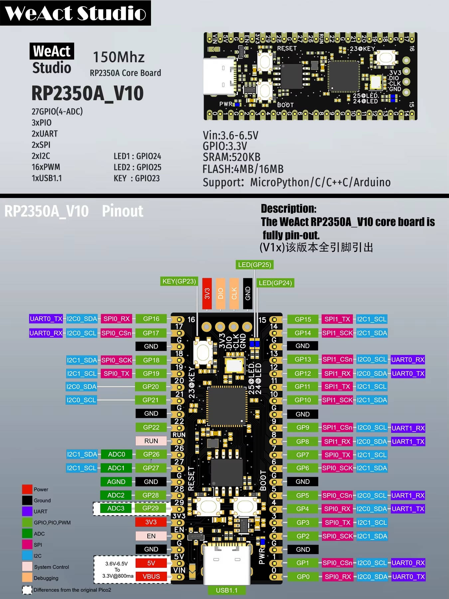
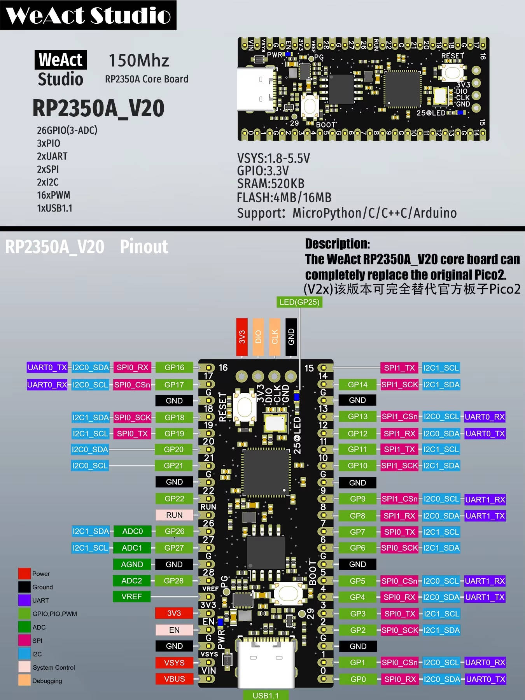

источник
https://www.raspberrypi.com/documentation/microcontrollers/silicon.html#rp2350
https://www.cnx-software.com/2024/08/08/raspberry-pi-pico-2-raspberry-pi-rp2350-dual-core-risc-v-or-arm-cortex-m33-microcontroller/

платка от WeAct без повышающего преобразователя по питанию

платка от WeAct почти как Pico-2 только микросхема flash другая
devboard

*******************************************************************************
Dual-core Arm Cortex-M33 @ 150 MHz with Arm Trustzone, Secure boot OR
Dual-core 32-bit RISC-V Hazard3 @ 150 MHz (3-stage in-order pipeline; RV32IMAC with Zba, Zbb, Zbs, Zbkb, Zcb, Zcmp, and Zicsr extensions)
 *RP2350 включает пару открытых аппаратных ядер Hazard3 RISC-V,
  которые могут быть заменены во время загрузки на ядра Cortex-M33.
 Наше загрузочное ПЗУ может даже автоматически определять архитектуру,
  для которой был построен двоичный файл второго этапа,
  и перезагружать чип в соответствующий режим.
 Все функции чипа,
  за исключением нескольких функций безопасности и ускорителя с плавающей точкой двойной точности,
  доступны в режиме RISC-V.

520KB on-chip multi-bank high performance SRAM

Support for up to 16MB of off-chip external Flash memory via dedicated QSPI bus

DMA controller

Fully-connected AHB crossbar

On-chip programmable LDO to generate core voltage

2 on-chip PLLs to generate USB and core clocks

30 GPIO pins, 4 of which can be used as analogue inputs
	RP2350A: up to 30x GPIOs, up to 4x ADC, up to 16x PWM channels
	RP2350B: up to 48x GPIOs, up to 8x ADC, up to 24x PWM channels

Peripherals

	USB 1.1 controller and PHY, with host and device support
	2x UART
	2x SPI controllers
	2x I2C controllers
	24x PWM channels
	3x PIO blocks, 12x PIO (Programmable IO) state machines

HSTX (high-speed serial transmit) streams data from the system clock domain to up to 8 GPIOs (IO12-IO19) at a rate independent of the system clock.

Temperature sensor

Security
	8KB of anti-fuse OTP for key storage
	SHA-256 acceleration
	Hardware TRNG
	Fast glitch detectors

Debugging – SWD Debug interface

Low power – Extended low-power sleep states with optional SRAM retention: as low as 10 μA DVDD

Package
	RP2350A – QFN-60; 7×7 mm
	RP2350B – QFN-80; 10×10 mm

*******************************************************************************

