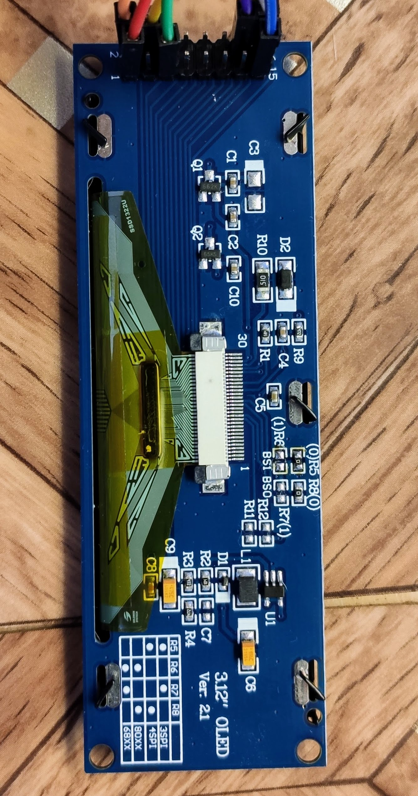

project

board HLK-W801-KIT-V1.1 + u8g2 + OLED 256x64  3'2 дюйма, SPI, контроллер ssd1322

Видео

дисплей
 OLED 256x64  3'2 дюйма, SPI, контроллер ssd1322

!перепаять перемычки в режим 4SPI!

фото 1 

фото 2

~~~
Разрешение экрана  - 256x64
~~~

соеденить по схеме:

~~~
---- ------
W801   LCD 1322  
---- ------
gnd  1  VSS (GND)  
3.3v 2  VCC
PB15 4  SCLK  синхросигнал
PB17 5  SDA  данные
PB21 15 RES  сброс (reset)
PB23 14 DC   комманда/данные
PB22 16 CS   выбор чипа
---- ------
W801 LCD   
---- ------

~~~

----------------------------------------------------

----------------------------------------------------

в проекте используеться библиотека u8g2
~~~

ее сборка https://github.com/nvv13/test/tree/main/test-mk/w801/sdk-prj/01_u8g2_st7920_spi
после сборки, сама библиотека libu8g2.a 
 разместить в директорию 
.\lib\w800\mod1\
и заголовочные файлы u8g2.h u8x8.h
 разместить директорию
.\include\mod1\

их еще можно взять из 
https://github.com/nvv13/test/tree/main/test-mk/w801/W801_SDK-linux/lib/w800/mod1
https://github.com/nvv13/test/tree/main/test-mk/w801/W801_SDK-linux/include/mod1

в Makefile директории . этого проекта
секция LINKLIB добавлено
    $(TOP_DIR)/lib/$(CONFIG_ARCH_TYPE)/mod1/libu8g2$(LIB_EXT)  \

~~~

--------------------------------------------------------------------------

Сборка  (это не конкретно этого проекта, а к примеру видео https://www.youtube.com/watch?v=uMJ7SQkhtYc 
           https://rutube.ru/video/664a1f911677ecb82c431247c4a5b3b7/?r=wd ):
~~~
делал по инструкциям из этого проекта https://github.com/droppingy/W801_SDK-linux
   у меня Linux Fedora 33 x86_64, думаю для всех Linux x86_64 подойдет

1) сначала, один раз, ставим утилиты для сборки c-sky (архитектура w806, w801 мк)
   благодаря пользователю droppingy это очень просто!  

$ sudo git clone https://github.com/droppingy/hlk-w80x-toolchain.git /opt/w80x-tools

   так чтобы в итоге получилось /opt/w80x-tools/bin
   это чтоб в menuconfig не переделывать, такой там путь по умолчанию
   (еще, в этом мануале https://github.com/IOsetting/wm-sdk-w806, есть ссылки как получить данный Toolchain на другие архитектуры, типа i386)

2) далее качаем SDK

    перемещаемся в домашнюю директорию
 
$ cd ~

    делаем директорию для проекта

$ mkdir w801

$ cd w801  

$ git clone https://github.com/leoay/wm-sdk-w80x-2023.git

3) далее, собираем приложение

$ cd wm-sdk-w80x-2023/

     если тут запустить make, то собирается демо приложение которое идет вместе с SDK, об этом я писал кратко в https://github.com/nvv13/test/tree/main/test-mk/w801 
     но мы хотим собрать другой проект
     для этого удаляем, лишние директории, 
      где app demo - директории с демо приложением
          bin - директория где в результате будет собранное приложение, создастся заново в процессе сборки

$ rm -R app demo bin

     делаем директорию для приложения

$ mkdir app

     и, в данном случае, качаем файлики приложения, 
     для примера, возьмем отсюда https://github.com/nvv13/test/tree/main/test-mk/w801/sdk-prj/02_task_blink
     но, принцип тот же самый и для других...(если нужно много файлов, то можно воспользоваться утилитой https://downgit.github.io/)

$ cd app

$ wget https://github.com/nvv13/test/raw/main/test-mk/w801/sdk-prj/02_task_blink/app/Makefile

$ wget https://github.com/nvv13/test/raw/main/test-mk/w801/sdk-prj/02_task_blink/app/main.c

     возвращаемся в директорию SDK
$ cd ..

     заменяем головной wget Makefile на наш (удалено обращение к директории demo)

$ rm Makefile

$ wget https://github.com/nvv13/test/raw/main/test-mk/w801/sdk-prj/02_task_blink/Makefile

     перед сборкой, очистить проект, иногда надо
$ make distclean

    сборка
$ make 

    перед прошивкой, стереть флэш в микроконтроллере, иногда надо, !когда, допустим был проект с wifi, а стал без него!
$ make erase

    записать прошивку
$ make flash

    Всё!

~~~

  далее подцепляемся к платке, если интересует вывод на консоль

$ picocom --echo -b 115200 /dev/ttyUSB0

  после подсоединения платка "висит", это из за сигнала RTS (про это есть обьяснение в статье https://www.cnblogs.com/milton/p/15621540.html)
  поэтому делаем CTRL + A + G   - это комманда picocom - RTS down, (нажимать надо достаточно быстро, (одновременно, но сначала CTRL))
  и пользуемся ...
          выход из picocom - CTRL + A + Q  (это выход без сброса порта (Skipping tty reset...))

~~~
PS:

~~~

